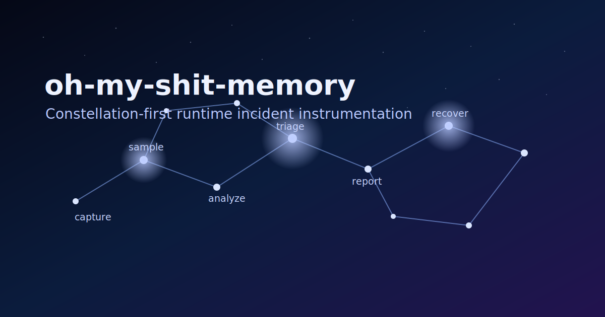
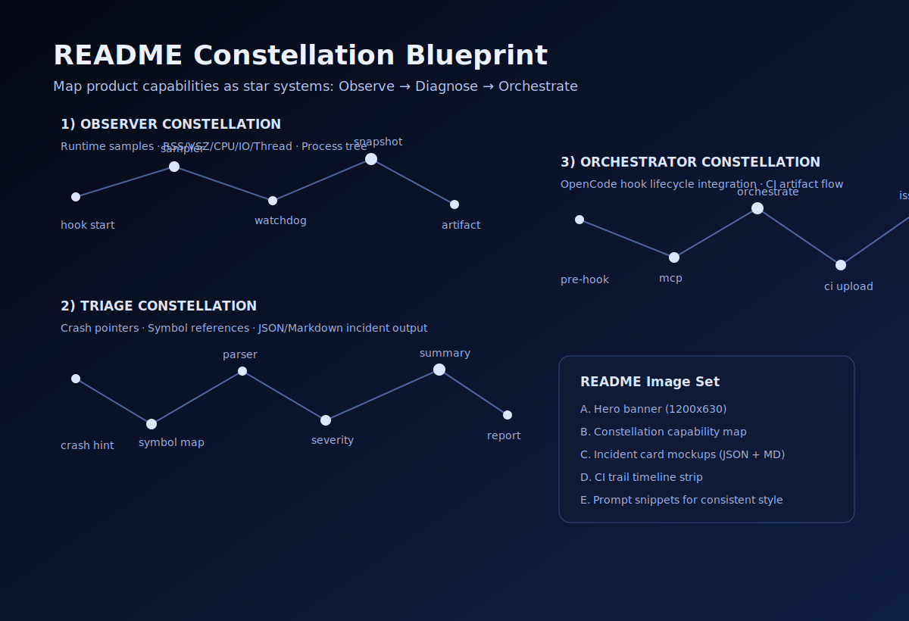

# oh-my-shit-memory



`oh-my-shit-memory` is a focused fork of `oh-my-opencode` with Linux-first runtime incident instrumentation for build/test workflows.

It captures:
- runtime resource samples (RSS/VSZ/CPU/IO/threads/process tree)
- crash pointers and symbol/build references
- incident analysis and triage outputs in JSON + Markdown

## README concept (constellation theme)

벤치마크 대상으로 언급한 `oh-my-opencode`의 "강한 메시지 + 구조화된 섹션" 톤을 유지하면서, 이 저장소는 **관측(Observe) → 진단(Diagnose) → 오케스트레이션(Orchestrate)** 흐름을 별자리처럼 보여주는 구성을 추천합니다.

### 1) Narrative frame

- **North Star (메인 약속)**: "크래시 순간을 잃지 않고 재현 가능한 인시던트 맵으로 남긴다"
- **Constellation story arc**:
  1. **Observer Constellation**: 런타임 샘플 수집
  2. **Triage Constellation**: 심볼/크래시 포인터 기반 진단
  3. **Orchestrator Constellation**: OpenCode hook + CI artifact 흐름 연결

### 2) Visual assets for README

아래 2개 SVG를 바로 사용할 수 있게 추가했습니다.

- Hero: `assets/readme/constellation-hero.svg`
- Capability map: `assets/readme/constellation-map.svg`



### 3) Suggested README section layout

1. **Hero + One-liner**
2. **Why this exists** (기존 관측 방식의 공백)
3. **How the constellation works** (Observe → Diagnose → Orchestrate)
4. **Quick start**
5. **Artifacts examples** (JSON / Markdown 결과 스니펫)
6. **Integration points** (hooks, standalone runner, MCP)
7. **Upstream credit**

### 4) Image generation prompts (for future polished renders)

- Hero prompt:
  - `Dark indigo night sky, constellation lines forming a software telemetry pipeline, minimal neon blue stars, cinematic but clean, github README friendly, 16:9`
- Architecture map prompt:
  - `Infographic in constellation style, three labeled star systems Observe Diagnose Orchestrate, technical but elegant, dark background, vector style, high readability`
- Incident card prompt:
  - `UI card mockups for crash incident report, JSON and markdown previews, starlight accents, developer tooling aesthetic`

## Repository scope

This repository currently includes:
- the `oh-my-shit-memory` feature implementation
- hook integration into the OpenCode plugin lifecycle
- CI artifact upload and deduped incident issue flow
- standalone runner + MCP scripts
- stability fixes for flaky port-dependent tests

## Quick start

```bash
bun install
bun test
bun run typecheck
bun run build
```

Run instrumentation around any command:

```bash
bun run script/oh-my-shit-memory-runner.ts -- bun test
```

## Key docs

- Guide: `docs/guide/oh-my-shit-memory.md`
- Config reference: `docs/reference/configuration.md` (`oh_my_shit_memory`)
- MCP script: `script/oh-my-shit-memory-mcp.ts`

## Upstream

This work originated from:
- https://github.com/code-yeongyu/oh-my-opencode
